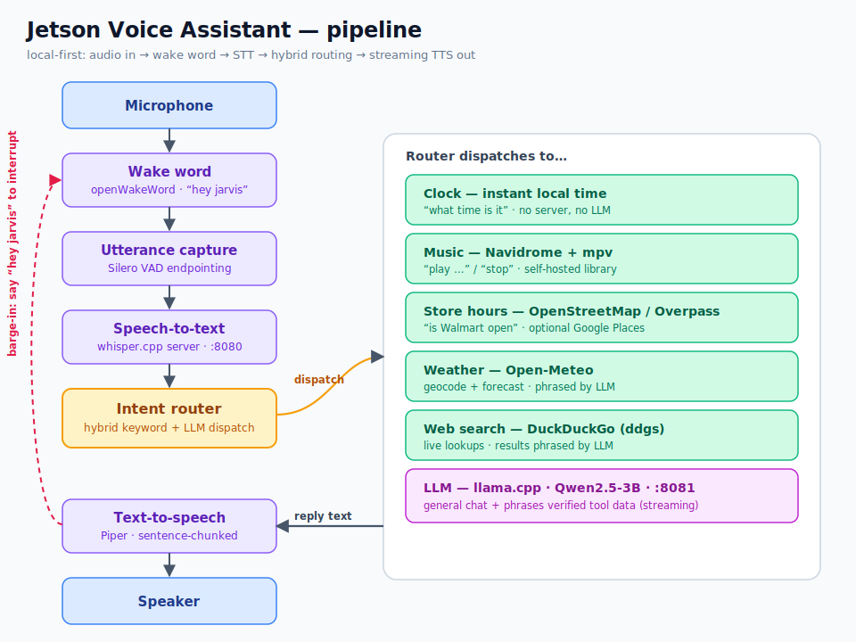

# Jetson Voice Assistant

A local-first, offline-friendly Alexa replacement. Say **"hey jarvis"**, ask a question, and get a spoken reply — with every stage (wake word, speech-to-text, routing, language model, text-to-speech) running on your own hardware. It is built to be developed on a Windows PC and deployed on a **Jetson Orin Nano 4GB**.

The trick that keeps a small 3B model useful: a **hybrid intent router** answers factual requests (time, weather, store hours, music, web search) from real data sources and only asks the LLM to *phrase* the answer or handle open-ended chat. The model never guesses store hours or weather from memory.

## Architecture



Flow: your voice is captured after the wake word, transcribed locally by whisper.cpp, and handed to the intent router. Instant intents (time, music, store hours) answer without touching the LLM. Weather and web-search results are fetched from real APIs and passed to the LLM only for natural phrasing. Anything open-ended goes straight to the LLM. The reply is streamed sentence-by-sentence to Piper for speech, and a concurrent wake-word listener lets you **barge in** mid-response.

### Pieces and how they connect

| Stage | Module | Talks to |
|-------|--------|----------|
| Wake word | `audio/wake_word.py` | openWakeWord (`hey_jarvis`), always listening |
| Capture | `audio/capture.py` | Silero VAD for end-of-speech detection |
| Speech-to-text | `services/stt_client.py` | **whisper.cpp** `whisper-server` on `:8080` |
| Routing | `intent_router.py` | keyword/regex fast paths + LLM tool-select |
| Language model | `services/llm_client.py` | **llama.cpp** `llama-server` on `:8081` (OpenAI-style `/v1/chat/completions`) |
| Text-to-speech | `services/tts_client.py` | **Piper** binary + `.onnx` voice |
| Conversation | `conversation.py` | short rolling history for follow-ups |
| Orchestration | `main.py` / `cli.py` | wake → record → STT → route → speak loop |

### Tools the router can reach

| Tool | Module | Backend | API key |
|------|--------|---------|---------|
| Clock | `intent_router.py` | local system time + timezone | none |
| Weather | `services/weather_client.py` | Open-Meteo (geocode + forecast) | none |
| Store hours | `services/store_hours_client.py` | OpenStreetMap / Overpass (optional Google Places) | none (Places optional) |
| Web search | `services/search_client.py` | DuckDuckGo via `ddgs` | none |
| Music | `services/music_client.py` | Navidrome + `mpv` | Navidrome login |
| General chat | `services/llm_client.py` | local llama.cpp model | none |

## Common abilities

Say **"hey jarvis"** first, then any of these:

- **Time** — "what time is it" *(instant, no LLM)*
- **Weather** — "what's the weather", "what's the weather in Berlin" *(Open-Meteo)*
- **Store hours** — "is Walmart open", "when does Canadian Tire close today" *(OpenStreetMap)*
- **Music** — "play lo-fi", "stop" *(Navidrome + mpv)*
- **Web search** — "who won the game last night", "latest news on …" *(DuckDuckGo → LLM)*
- **General chat** — "tell me a joke", "explain photosynthesis" *(local LLM)*
- **Follow-ups** — if the assistant asks a question back, answer without repeating the wake word.
- **Barge-in** — say "hey jarvis" again while it is talking to interrupt and ask something new.

## Configuration

Two files, kept out of source control:

- **`config/defaults.json`** — location, timezone, assistant name, units, time format. Copy from [`config/defaults.example.json`](config/defaults.example.json).
- **`.env`** — secrets, local paths, machine-specific overrides. Copy from [`.env.example`](.env.example).

Environment variables override `config/defaults.json` when both set the same value. Do not hardcode paths or keys in `src/jetson_assistant/config.py`.

---

## Setup — Windows (development)

The fastest way to develop and demo. See [`docs/windows-demo-next-steps.md`](docs/windows-demo-next-steps.md) for the detailed walkthrough.

### 1. Prerequisites (not managed by `uv`)

| What | Purpose | Source |
|------|---------|--------|
| [uv](https://docs.astral.sh/uv/getting-started/installation/) | Python env manager | astral.sh |
| [whisper.cpp](https://github.com/ggerganov/whisper.cpp/releases) + `ggml-base.en.bin` | local STT server | GitHub / [HF](https://huggingface.co/ggerganov/whisper.cpp/tree/main) |
| [llama.cpp](https://github.com/ggerganov/llama.cpp/releases) + Qwen2.5-3B-Instruct Q4_K_M GGUF | local LLM server | GitHub / [HF](https://huggingface.co/Qwen/Qwen2.5-3B-Instruct-GGUF) |
| [Piper voice](https://huggingface.co/rhasspy/piper-voices) `.onnx` + `.onnx.json` | TTS voice | HuggingFace |
| [mpv](https://mpv.io/installation/) *(optional)* | music playback | mpv.io |
| [Navidrome](https://github.com/navidrome/navidrome/releases) *(optional)* | self-hosted music | GitHub |

Suggested layout:

```
D:\Applications\
  whisper.cpp\whisper-server.exe
  llama.cpp\llama-server.exe
D:\GitHub\jetson-nano-jarvis\
  models\whisper\ggml-base.en.bin
  models\llm\qwen2.5-3b-instruct-q4_k_m.gguf
  models\piper\en\american\en_US-norman-medium.onnx (+ .onnx.json)
  .venv\Scripts\piper.exe   (installed by uv sync)
```

### 2. Set up the environment

```powershell
uv sync
copy .env.example .env
copy config\defaults.example.json config\defaults.json
```

Edit `.env` (at minimum `PIPER_VOICE` and `PIPER_BIN`) and `config\defaults.json` (location, timezone). Leave `ASSISTANT_MIC_DEVICE` / `ASSISTANT_SPEAKER_DEVICE` blank to use Windows defaults; list devices with:

```powershell
uv run python -c "import sounddevice as sd; print(sd.query_devices())"
```

### 3. Start the two local servers (leave both running)

```powershell
# Terminal 1 — STT
D:\Applications\whisper.cpp\whisper-server.exe -m models\whisper\ggml-base.en.bin --host 127.0.0.1 --port 8080

# Terminal 2 — LLM
D:\Applications\llama.cpp\llama-server.exe -m models\llm\qwen2.5-3b-instruct-q4_k_m.gguf --host 127.0.0.1 --port 8081 --n-gpu-layers 999 --ctx-size 2048
```

### 4. Check and run

```powershell
# Terminal 3 — startup check, then run
uv run python -c "from jetson_assistant.main import startup_check; startup_check()"
uv run jetson-assistant
```

Say **"hey jarvis"**, then try `what time is it`.

> **CUDA PyTorch (optional):** `uv sync` installs CPU `torch`, which is fine for the Silero VAD. For CUDA: `uv pip install torch torchaudio --index-url https://download.pytorch.org/whl/cu124`

---

## Setup — Linux on Jetson Orin Nano 4GB

Same code, ARM64 CUDA build. **Do not copy the Windows binaries** — rebuild whisper.cpp and llama.cpp on the device.

### 1. Base system

1. Flash **JetPack 6.x** and confirm the GPU is alive with `tegrastats`.
2. Install `uv`, then clone this repo and `uv sync`.
3. `cp .env.example .env` and `cp config/defaults.example.json config/defaults.json`, then edit them.

### 2. Build the model servers with CUDA

```bash
# whisper.cpp (CUDA)
git clone https://github.com/ggerganov/whisper.cpp && cd whisper.cpp
cmake -B build -DGGML_CUDA=1 && cmake --build build -j --config Release
# grab ggml-base.en.bin (drop to tiny.en if 4GB is tight)

# llama.cpp (CUDA)
git clone https://github.com/ggerganov/llama.cpp && cd llama.cpp
cmake -B build -DGGML_CUDA=1 && cmake --build build -j --config Release
# download Qwen2.5-3B-Instruct Q4_K_M GGUF (or Llama 3.2 3B Q4)
```

### 3. Audio, TTS, and music

1. Install **Piper** and a voice such as `en_US-lessac-medium.onnx`; set `PIPER_BIN` / `PIPER_VOICE` in `.env`.
2. Plug in the **ReSpeaker USB Mic Array** (its AEC helps barge-in), then set `ASSISTANT_MIC_DEVICE` in `.env` after checking Linux device IDs.
3. Run **Navidrome** on a separate always-on box so it does not fight the Jetson for 4GB.

### 4. Run

```bash
# Terminal 1 — STT
~/whisper.cpp/build/bin/whisper-server -m ~/whisper.cpp/models/ggml-base.en.bin \
  --host 127.0.0.1 --port 8080

# Terminal 2 — LLM
~/llama.cpp/build/bin/llama-server -m ~/models/qwen2.5-3b-instruct-q4_k_m.gguf \
  --host 127.0.0.1 --port 8081 --n-gpu-layers 999 --ctx-size 2048

# Terminal 3 — assistant
uv run jetson-assistant
```

Wrap the two servers in `systemd` units so the whole thing survives a reboot.

### 4GB survival tips

- If you hit `cudaMalloc failed`, drop whisper `base.en` → `tiny.en`, or use a 1B LLM.
- Keep the LLM at **1B–3B, Q4** even if a bigger one loads.
- Keep Piper to a single small voice model.
- Set `RESOURCE_LOG_INTERVAL_SECONDS` in `.env` to watch memory/CPU while tuning.

---

## Project layout

```
src/jetson_assistant/
  audio/          wake_word.py, capture.py   (mic-side pipeline)
  services/       stt, llm, tts, weather, store_hours, music, search clients
  intent_router.py    hybrid routing (fast paths + LLM tool-select)
  conversation.py     rolling chat history
  main.py / cli.py    startup checks + main loop  (jetson-assistant entry point)
  config.py           resolves .env + config/defaults.json
config/           defaults.example.json
docs/             windows-demo-next-steps.md, architecture.svg
```

## Known rough edges

- 4GB is tight running whisper.cpp + llama.cpp together — shrink models if it OOMs.
- No echo cancellation on Windows yet; the ReSpeaker's AEC on Jetson helps. False barge-in triggers from speaker bleed are possible but rare with "hey jarvis".
- `mpv` must be on `PATH`; the music client is single-user (kills the previous track).
- The project is source-first — a PyInstaller/Nuitka Jetson bundle is possible later.
